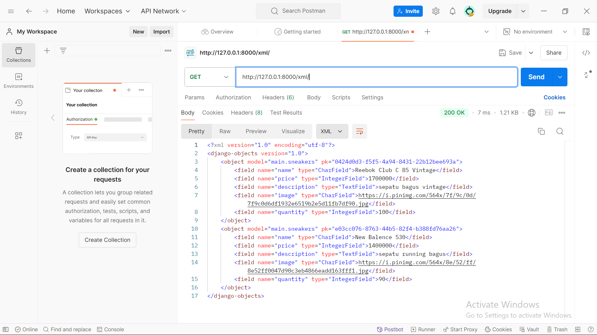
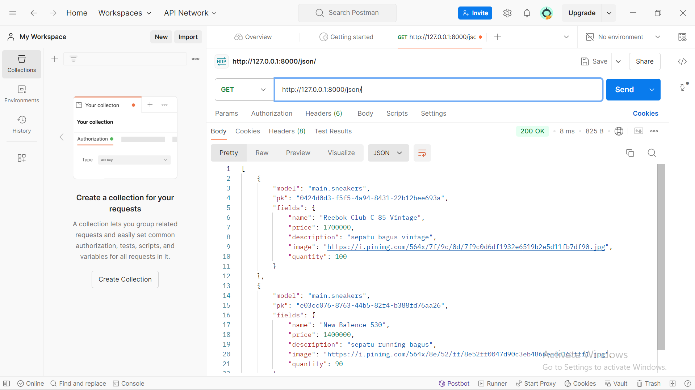
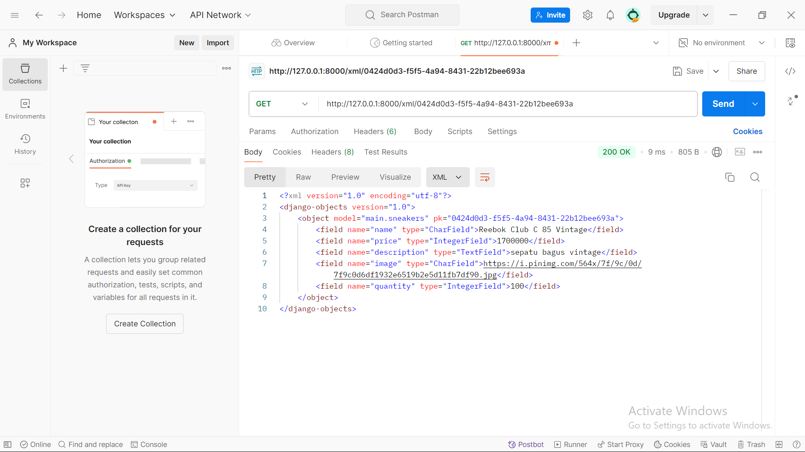
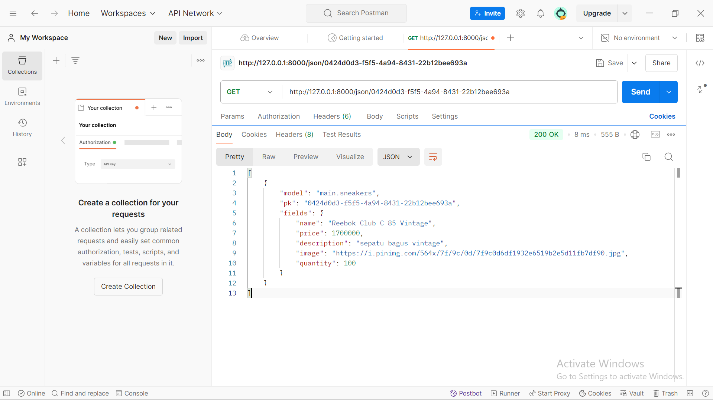

## Link = [http://muhammad-satria31-appecommerce.pbp.cs.ui.ac.id/](http://muhammad-satria31-appecommerce.pbp.cs.ui.ac.id/)

## Tugas

1. Jelaskan bagaimana cara kamu mengimplementasikan checklist di atas secara step-by-step (bukan hanya sekadar mengikuti tutorial)

1.Buat proyek Django baru.
2.Buat direktori baru bernama app-e-commerce sebagai local directory.
3.Buat repository GitHub baru bernama app-e-commerce.
4.Buat dan edit file README.md menggunakan VSCode.
5.Inisialisasi Git di app-e-commerce 
6.git init, git branch -M main, git remote add origin (link git kita), git push -u origin main.
7.Buat virtual environment dengan python -m venv env dan aktifkan dengan source env/bin/activate.
8.Buat requirements.txt dan isi dengan dependencies yang diperlukan, lalu install dengan pip install -r requirements.txt.
9.Inisialisasi proyek Django dengan django-admin startproject app-e-commerce
10.Edit settings.py: ubah ALLOWED_HOSTS = [] menjadi ALLOWED_HOSTS = ["localhost", "127.0.0.1"].
11.Buat file .gitignore untuk mengabaikan file yang tidak perlu ditrack Git.
12.Buat aplikasi Django baru bernama main dengan python manage.py startapp main.
13.Tambahkan 'main' ke INSTALLED_APPS di settings.py.
14.Buat folder templates di dalam direktori main untuk menyimpan file main.html.
15.Buat file main.html dengan konten yang diperlukan.
16.Atur routing URL dengan mengedit urls.py di app-e-commerce
17.Buat model Item di models.py
18.Edit views.py untuk menghubungkan Views dan Templates
19.Edit urls.py di main
20.update repository 

2. Buatlah bagan yang berisi request client ke web aplikasi berbasis Django beserta responnya dan jelaskan pada bagan tersebut kaitan antara urls.py, views.py, models.py, dan berkas html.

Client -> Internet -> Python/Django -> urls.py -> views.py (proses URL) -> models.py (read/write data) -> Database -> templates (input/display data) -> Return HTML (merge dengan value) -> Internet -> device client.

3. Jelaskan fungsi git dalam pengembangan perangkat lunak!

-Pengelolaan Perubahan Kode: Git mencatat setiap perubahan kode yang dilakukan oleh pengembang, memungkinkan mereka melacak versi sebelumnya, mengetahui siapa yang membuat perubahan, dan memahami alasan di balik perubahan tersebut.

-Kerja Sama Tim: Git memfasilitasi kolaborasi antar anggota tim dengan memungkinkan mereka bekerja secara terpisah pada cabang (branch) masing-masing tanpa mengganggu pekerjaan satu sama lain. Setelah pengembangan atau perbaikan selesai, cabang ini dapat digabung kembali ke kode utama.

-pemulihan dan Penyelesaian Konflik: Git memungkinkan pengembang untuk kembali ke versi kode yang stabil jika terjadi kesalahan, serta membantu menyelesaikan konflik saat beberapa orang mengedit bagian kode yang sama.

4. Menurut Anda, dari semua framework yang ada, mengapa framework Django dijadikan permulaan pembelajaran pengembangan perangkat lunak?

- Django sering dipilih sebagai framework pertama dalam pembelajaran pengembangan perangkat lunak karena memiliki beberapa keunggulan yang membuatnya cocok untuk pemula. Pertama, Django sudah dilengkapi dengan banyak fitur bawaan, seperti autentikasi pengguna, manajemen database, dan URL routing, sehingga kita tidak perlu membangun semuanya dari nol. Ini membantu pengembang baru untuk lebih fokus pada logika aplikasi daripada hal-hal teknis yang rumit.

- Selain itu, Django mengikuti prinsip "batteries included", yang berarti banyak kebutuhan pengembangan umum sudah tersedia dan siap pakai. Ini membuat proses belajar lebih mudah karena pengembang tidak harus mencari atau mengatur banyak alat tambahan.

- Django juga mengedepankan praktik pengembangan yang baik, seperti pembagian tugas antara bagian yang mengatur logika (views), data (models), dan tampilan (templates) melalui arsitektur Model-View-Template (MVT). Dengan pendekatan ini, pengembang belajar cara mengorganisasi kode dengan baik dari awal.

5. Mengapa model pada Django disebut sebagai ORM?
    1. Mudah Dipelajari dan Dipakai:
    Django memiliki dokumentasi yang sangat lengkap dan terstruktur dengan baik, sehingga memudahkan pemula memahami konsep-konsep dasar pengembangan web. Selain itu, Django juga memiliki banyak tutorial dan komunitas yang besar    

    2. Praktik Terbaik dan Struktur yang Jelas:
    Django dirancang dengan prinsip "konvensi lebih baik daripada konfigurasi" dan "don't repeat yourself (DRY)." Ini berarti framework ini memberikan struktur proyek yang jelas dan mendorong praktik pengkodean yang baik. 

## Tugas 3

1. Jelaskan mengapa kita memerlukan data delivery dalam pengimplementasian sebuah platform?
jawab : kita memerlukannya karena data tersebut dapat digunakan antara aplikasi walaupun berbeda stack atau framework nya

2.Menurutmu, mana yang lebih baik antara XML dan JSON? Mengapa JSON lebih populer dibandingkan XML?
jawab : menurut saya JSON lebih baik, mengapa JSON lebih popular dari XML karena XML lebih susah untuk diubah dibandingkan JSON karena JSON dapat diubah dengan mudah ke dalam JavaScript Object 

3.Jelaskan fungsi dari method is_valid() pada form Django dan mengapa kita membutuhkan method tersebut?
jawab : untuk mevalidasi input user pada form, kita membutuhkan method tersebut agar hasil input dari user sesuai dengan yang diinginkan ketika hendak dimasukkan ke dalam database

4.Mengapa kita membutuhkan csrf_token saat membuat form di Django? Apa yang dapat terjadi jika kita tidak menambahkan csrf_token pada form Django? Bagaimana hal tersebut dapat dimanfaatkan oleh penyerang?
jawab : kita membutuhkan csrf_token karena untuk keamanan aplikasi, jika tidak menambahkan csrf_token kita tidak bisa menambahkan data dan akan menuju ke halam Forbidden (403), hal tersebut dapat dimanfaatkan oleh penyerang dengan memanipulasi csrf token agar dapat menambahkan data lain.

5. Jelaskan bagaimana cara kamu mengimplementasikan checklist di atas secara step-by-step (bukan hanya sekadar mengikuti tutorial).
jawab : langkah langkah ada di bawah ini:

1. membuat file form
2. membuat kerangka HTML agar dapat menampilkan form dan hasil data
3. menambahkan UUID pada model
4. membuat URL untuk menampilkan data dalam bentuk XML, JSON, XML by ID, JSON by ID
5. menggunakan Postman untuk melihat data
6. membuat script GitHub Actions untuk melakukan push ke PWS secara automatis

## Tugas 4

1. Apa perbedaan antara HttpResponseRedirect() dan redirect()
jawab : HttpResponseRedirect() adalah kelas Django yang digunakan untuk mengirim respons ke redirect, sedangkan redirect merupakan shortcut untuk menerima path URL, nama view, atau bahkan intance model.

2. Jelaskan cara kerja penghubungan model MoodEntry dengan User!
jawab : Model Sneakers memiliki relasi ke model User yang sudah disediakan oleh Django melalui django.contrib.auth.models.User. Biasanya ini diimplementasikan dengan menggunakan ForeignKey. ForeignKey pada Sneakers menunjuk ke model user, saat pengguna login dan mengisi entri sneakers, objek user yang sedang login diambil dari request dan simpan di kolom user dari model Sneakers

3. Apa perbedaan antara authentication dan authorization, apakah yang dilakukan saat pengguna login? Jelaskan bagaimana Django mengimplementasikan kedua konsep tersebut.
jawab : Authentication adalah proses memverifikasi identitas pengguna, biasanya dengan memeriksa kredensial (username dan password), sedangkan Authorization adalah proses memeriksa hak akses pengguna setelah mereka terautentikasi. Ini menentukan apakah pengguna memiliki izin untuk mengakses sumber daya tertentu.

Django menggunakan middleware AuthenticationMiddleware untuk menangani proses login dan otentikasi. Ketika pengguna login, Django menyimpan informasi pengguna di session. Django menyediakan authenticate() untuk memeriksa kredensial dan login() untuk menyimpan informasi pengguna yang telah terautentikasi.

4. Django menggunakan session dan cookies untuk mengingat pengguna yang login:
    -Setelah pengguna berhasil login, Django membuat session yang menyimpan ID pengguna dalam basis data.
    -Django mengirimkan session cookie ke browser pengguna, yang berisi kunci unik (session key). 
    -Kunci ini digunakan untuk mengidentifikasi session pengguna di sisi server setiap kali mereka melakukan request.

Cookies juga bisa digunakan untuk menyimpan data lain, seperti preferensi pengguna. Django mendukung signed cookies untuk memastikan bahwa data dalam cookies tidak dimanipulasi oleh pengguna. Tidak semua cookies aman secara default. Cookies aman adalah cookies yang dienkripsi dan hanya dapat diakses melalui HTTPS

5.  Jelaskan bagaimana cara kamu mengimplementasikan checklist di atas secara step-by-step (bukan hanya sekadar mengikuti tutorial).
jawab : 

1. membuat fungsi dan form 
2. buat berkas register.html
3. membuat fungsi login
4. import from django.contrib.auth.forms import UserCreationForm, AuthenticationForm
from django.contrib.auth import authenticate, login
5. buat login.html
6. membuat fungsi logout
7. merestriksi akses halaman main agar muncul paling awal untuk login
8. menggunakan data cookies 
9. hubungkan model Sneakers ke User
10. ubah sneakers = Sneakers.objects.filter(user=request.user) agar menghubungkan object ke satu akun
11. makemigrations dan migrate model yang ditambahkan variabel baru
12. import os ke settings.py dan buat DEBUG = not PRODUCTION 
11. add, commit, dan push ke github

## Tugas 5

1. Jika terdapat beberapa CSS selector untuk suatu elemen HTML, jelaskan urutan prioritas pengambilan CSS selector tersebut!
jawab : 

    urutan prioritas CSS selector sebagai berikut:

    1. inline styles: CSS yang didefinisikan langsung dalam atribut style pada elemen HTML

    2. ID selectors: CSS yang menggunakan selektor ID (#id).  Ini memiliki prioritas lebih tinggi dibandingkan class dan tag.

    3. Class selectors, pseudo-class selectors, dan attribute selectors: Selektor yang menggunakan class (.class), pseudo-class (:hover), atau attribute ([type="text"]). 

    4. Tag selectors: Selektor yang merujuk pada elemen HTML secara langsung (div, h1, p). Ini memiliki prioritas terendah.

2. Mengapa responsive design menjadi konsep yang penting dalam pengembangan aplikasi web? Berikan contoh aplikasi yang sudah dan belum menerapkan responsive design! 
jawab :

    - Renponsive design penting karena untuk membuat situs web agar tampak dan berfungsi dengan bagus di semua perangkat

    - contoh aplikasi yang sudah menerapkan adalah twitter, youtube, instagram

    - contoh aplikasi yang belum menerapkan adalah situs lama yang hanya dirancang di layar dekstop

3.  Jelaskan perbedaan antara margin, border, dan padding, serta cara untuk mengimplementasikan ketiga hal tersebut! 
jawab : 

    - margin
        margin adalah raug di lua border elemen yang memisahkan elemen dari elemen yang lain di sekitar elemen tersebut.

        contoh implementasi:
            div {
                margin: 20px;
            }

    - border
        border adalah garis di sekeliling elemen yang terletak antara padding dan margin dan bisa berupa garis solid, dotted, dsb.

        contoh implementasi:
            div {
                border: 2px solid black;
            }

    - padding
        padding adalah ruang di dalam elemen, antara konten dan border dan dapat menambahkan jarak antara konten dan batas dalam elemen.

        contoh implementasi:
            div {
                padding: 10px;
            }

4. Jelaskan konsep flex box dan grid layout beserta kegunaannya!
jawab:

    - Flexbox
        Flexbox digunakan untuk menyusun elemen secara satu dimensi dan sangat berguna untuk membuat layout yang renponsif dan fleksibel, terutama untuk menyusun yang perlu dibuat secara dinamis

        kegunaan:
            lebih cocok untuk layout yang sederhana dan satu dimensi, seperti membuat navigasi dll

    - Grid layout
        Grid layout digunakan untuk menyusun elemen secara dua dimensi dan memungkinkan mengontrol dengan lebih baik terhadap baris dan kolom.

        kegunaan:
            cocok untuk layout yang lebih kompleks dengan struktur baris dan kolom.

5. Jelaskan bagaimana cara kamu mengimplementasikan checklist di atas secara step-by-step
jawab :

1. menambahkan Tailwind atau Bootsrap ke aplikasi di bagian base.html
2. tambahkan viewport
3. menambahkan fitur edit Sneakers
4. buat berkas edit_sneakers.html
5. tambahkan path di url
6. tambah path edit mood ke main.html
7. tambahkan fitur hapus Sneakers
8. tambahkan path di url
9. tambah path hapus Sneakers ke main.htmlm
10. menambahkan navigation bar pada aplikasi
11. buat berkas navbar.html
12. konfigurasi statis files pada aplikasi
13. menambahkan style pada aplikasi dengan tailwind dan eksternal CSS
14. tambahkan global.css
15. hubungkan global.css dan script tailwind ke base.html
16. menambahkan custom styling ke global.css
17. styling halam login, register, home, create Sneakers, edit Sneakers
18. add, commit, dan push ke git dan pws

## Tugas 6
1. Jelaskan manfaat dari penggunaan JavaScript dalam pengembangan aplikasi web!
jawab : maanfaat dari JavaScript dapat membuat halaman web menjadi lebih interaktif dan dinamis dengan menambahkan elemen-elemen seperti animasi, dropdown menu, dan slide show, implementasi AJAX

2. Jelaskan fungsi dari penggunaan await ketika kita menggunakan fetch()! Apa yang akan terjadi jika kita tidak menggunakan await?
jawab : fungsi await ketika kita menggunakan fetch() untuk menunggu hasil proses fetch() selesai terlebih dahulu kemudian baru bisa menjalankan program selanjutnya
        jika tidak menggunakan await maka program akan berjalan secara sinkronus dan menyebabkan program selanjutnya tidak dapat berjalan karena bisa jadi fetch belum selesai

3. Mengapa kita perlu menggunakan decorator csrf_exempt pada view yang akan digunakan untuk AJAX POST?
jawab: kita perlu menggunakan decorator csrf_exempt pada view yang akan digunakan untuk AJAX POST untuk keamanan ketika melakukan method "POST"

4. Pada tutorial PBP minggu ini, pembersihan data input pengguna dilakukan di belakang (backend) juga. Mengapa hal tersebut tidak dilakukan di frontend saja?
jawab : untuk pengamanan yang lebih kuat, pembersihan data input di backend berguna untuk ketika user memanipulasi data atau mengisi form tidak akan terjadi Cross Site Scripting atau XSS.

5. Jelaskan bagaimana cara kamu mengimplementasikan checklist di atas secara step-by-step (bukan hanya sekadar mengikuti tutorial)!
jawab : 

1. membuat fungsi AJAX untuk menambahkan add_sneakers
2. menambahkan data sneakers dengan fetch API 
3. membuat modal form untuk menambahkan sneakers
4. manambahkan data sneakers dengan AJAX
5. mengimplementasikan Strip Tags untuk menghindari Cross Site Scripting atau XSS
6. membersihkan data menggunakan DOMPurify

